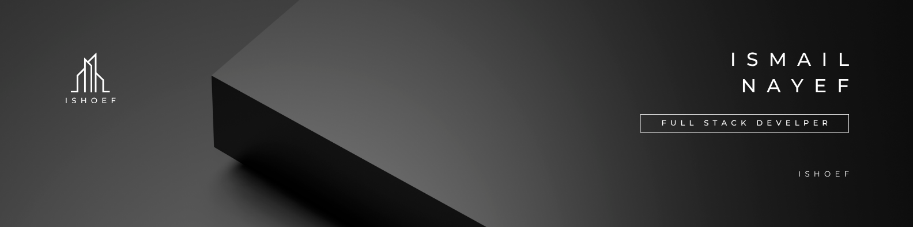

<!-- Header Banner -->

  

<h1 align="center">👋 Hi, I'm Ismail Hossan Nayef</h1>

  <b>Programmer • Web Developer • Front-End Enthusiast</b>

---

### 👨‍💻 About Me

- 🌠I'm from **Bangladesh**  

- 🎯 Passionate about **Frontend development**, especially **React.js**, **Next.js**, and **design systems**
- 🎨 Exploring **Figma**, **Framer**, and UI/UX design
- 🔧 Enjoy working with **Node.js**, **Express**, and backend fundamentals
- 🌱 Currently learning **Advanced React & Next.js**
- - ✍️ Love writing clean code & beautiful UIs
 

---

### 🚀 Current Goals

- 🚀 Launching a new side project soon!
- 🎨 Improving my design-to-code workflow
- 📚 Learning performance optimization in React apps
- 🤝 Open to collaborations!

---

### 🧰 Tech Stack

  

  

  

---

### 📈 GitHub Stats

  

---

### 📫 Let's Connect

  
  
  

